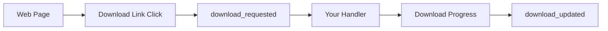

# Downloads

Godot CEF provides full control over file downloads initiated by web pages. When a user clicks a download link or a page triggers a download, CEF emits signals to Godot instead of automatically downloading the file. This gives you complete control over the download process.

## How It Works

When a download is requested in the browser:

1. CEF intercepts the download request
2. The `download_requested` signal is emitted with file information
3. Your code decides whether to proceed, show a dialog, or ignore
4. If the download proceeds, `download_updated` signals track progress
5. A final `download_updated` signal indicates completion or cancellation



::: warning
Downloads do NOT start automatically. You must handle the `download_requested` signal and decide what to do with each download. This is a security feature that prevents unwanted file downloads.
:::

## Basic Usage

```gdscript
extends Control

@onready var cef_texture: CefTexture = $CefTexture

func _ready():
    cef_texture.download_requested.connect(_on_download_requested)
    cef_texture.download_updated.connect(_on_download_updated)

func _on_download_requested(info: DownloadRequestInfo):
    print("Download requested:")
    print("  File: ", info.suggested_file_name)
    print("  URL: ", info.url)
    print("  Type: ", info.mime_type)
    print("  Size: ", _format_bytes(info.total_bytes))
    
    # Show confirmation dialog, save to custom location, etc.

func _on_download_updated(info: DownloadUpdateInfo):
    if info.is_complete:
        print("✓ Download complete: ", info.full_path)
    elif info.is_canceled:
        print("✗ Download canceled")
    else:
        print("Downloading: %d%%" % info.percent_complete)

func _format_bytes(bytes: int) -> String:
    if bytes < 0:
        return "Unknown size"
    elif bytes < 1024:
        return "%d B" % bytes
    elif bytes < 1024 * 1024:
        return "%.1f KB" % (bytes / 1024.0)
    else:
        return "%.1f MB" % (bytes / (1024.0 * 1024.0))
```

## Signals

### `download_requested(download_info: DownloadRequestInfo)`

Emitted when a download is initiated. This happens when:
- A user clicks a download link
- JavaScript triggers a file download
- A page redirects to a downloadable resource
- The server responds with `Content-Disposition: attachment`

**DownloadRequestInfo Properties:**

| Property | Type | Description |
|----------|------|-------------|
| `id` | `int` | Unique identifier for this download |
| `url` | `String` | The URL being downloaded |
| `original_url` | `String` | Original URL before redirects |
| `suggested_file_name` | `String` | Suggested filename from server |
| `mime_type` | `String` | MIME type (e.g., `application/pdf`) |
| `total_bytes` | `int` | File size in bytes, or -1 if unknown |

### `download_updated(download_info: DownloadUpdateInfo)`

Emitted periodically during download progress and when the download completes or is canceled.

**DownloadUpdateInfo Properties:**

| Property | Type | Description |
|----------|------|-------------|
| `id` | `int` | Unique identifier (matches `download_requested`) |
| `url` | `String` | The URL being downloaded |
| `full_path` | `String` | Full path where file is being saved |
| `received_bytes` | `int` | Bytes downloaded so far |
| `total_bytes` | `int` | Total file size, or -1 if unknown |
| `current_speed` | `int` | Current speed in bytes per second |
| `percent_complete` | `int` | Progress (0-100), or -1 if unknown |
| `is_in_progress` | `bool` | `true` if still downloading |
| `is_complete` | `bool` | `true` if successfully completed |
| `is_canceled` | `bool` | `true` if canceled or failed |

## Common Use Cases

### Download Confirmation Dialog

```gdscript
var pending_downloads: Dictionary = {}

func _on_download_requested(info: DownloadRequestInfo):
    # Store the download info
    pending_downloads[info.id] = info
    
    # Show confirmation dialog
    var dialog = ConfirmationDialog.new()
    dialog.dialog_text = "Download %s?\nSize: %s" % [
        info.suggested_file_name,
        _format_bytes(info.total_bytes)
    ]
    dialog.confirmed.connect(_on_download_confirmed.bind(info.id))
    dialog.canceled.connect(_on_download_declined.bind(info.id))
    add_child(dialog)
    dialog.popup_centered()

func _on_download_confirmed(download_id: int):
    var info = pending_downloads.get(download_id)
    if info:
        print("User approved download: ", info.suggested_file_name)
        # NOTE: Starting downloads programmatically is not implemented yet.
        # The API to accept/start downloads is still pending.
        pending_downloads.erase(download_id)

func _on_download_declined(download_id: int):
    pending_downloads.erase(download_id)
    print("User declined download")
```

### Download Progress UI

```gdscript
extends Control

@onready var cef_texture: CefTexture = $CefTexture
@onready var progress_bar: ProgressBar = $DownloadProgress
@onready var speed_label: Label = $SpeedLabel
@onready var status_label: Label = $StatusLabel

var active_downloads: Dictionary = {}

func _ready():
    cef_texture.download_requested.connect(_on_download_requested)
    cef_texture.download_updated.connect(_on_download_updated)
    progress_bar.visible = false

func _on_download_requested(info: DownloadRequestInfo):
    active_downloads[info.id] = {
        "name": info.suggested_file_name,
        "total": info.total_bytes
    }
    progress_bar.visible = true
    progress_bar.value = 0
    status_label.text = "Starting: " + info.suggested_file_name

func _on_download_updated(info: DownloadUpdateInfo):
    if not active_downloads.has(info.id):
        return
    
    if info.is_complete:
        status_label.text = "✓ Complete: " + active_downloads[info.id].name
        progress_bar.value = 100
        active_downloads.erase(info.id)
        # Hide after delay
        await get_tree().create_timer(2.0).timeout
        if active_downloads.is_empty():
            progress_bar.visible = false
    
    elif info.is_canceled:
        status_label.text = "✗ Canceled"
        active_downloads.erase(info.id)
        if active_downloads.is_empty():
            progress_bar.visible = false
    
    else:
        progress_bar.value = info.percent_complete if info.percent_complete >= 0 else 0
        var speed_kb = info.current_speed / 1024.0
        speed_label.text = "%.1f KB/s" % speed_kb
        status_label.text = "Downloading: %s (%d%%)" % [
            active_downloads[info.id].name,
            info.percent_complete
        ]
```

### Filter Downloads by Type

```gdscript
const ALLOWED_MIME_TYPES = [
    "application/pdf",
    "image/png",
    "image/jpeg",
    "application/zip"
]

const BLOCKED_EXTENSIONS = [".exe", ".bat", ".cmd", ".msi", ".scr"]

func _on_download_requested(info: DownloadRequestInfo):
    # Check MIME type
    if info.mime_type not in ALLOWED_MIME_TYPES:
        print("Blocked download - MIME type not allowed: ", info.mime_type)
        return
    
    # Check file extension
    var filename = info.suggested_file_name.to_lower()
    for ext in BLOCKED_EXTENSIONS:
        if filename.ends_with(ext):
            print("Blocked download - dangerous extension: ", ext)
            return
    
    # Download is allowed
    print("Allowing download: ", info.suggested_file_name)
```

### Track Multiple Simultaneous Downloads

```gdscript
class_name DownloadManager
extends Node

signal all_downloads_complete

var downloads: Dictionary = {}

func _on_download_requested(info: DownloadRequestInfo):
    downloads[info.id] = {
        "name": info.suggested_file_name,
        "url": info.url,
        "total_bytes": info.total_bytes,
        "received_bytes": 0,
        "status": "pending"
    }
    print("New download #%d: %s" % [info.id, info.suggested_file_name])

func _on_download_updated(info: DownloadUpdateInfo):
    if not downloads.has(info.id):
        return
    
    var download = downloads[info.id]
    download.received_bytes = info.received_bytes
    
    if info.is_complete:
        download.status = "complete"
        download.path = info.full_path
        print("Download #%d complete" % info.id)
        _check_all_complete()
    
    elif info.is_canceled:
        download.status = "canceled"
        print("Download #%d canceled" % info.id)
        _check_all_complete()
    
    else:
        download.status = "downloading"

func _check_all_complete():
    for id in downloads:
        var status = downloads[id].status
        if status == "pending" or status == "downloading":
            return
    emit_signal("all_downloads_complete")

func get_active_count() -> int:
    var count = 0
    for id in downloads:
        if downloads[id].status == "downloading":
            count += 1
    return count

func get_total_progress() -> float:
    var total_bytes = 0
    var received_bytes = 0
    for id in downloads:
        var d = downloads[id]
        if d.total_bytes > 0:
            total_bytes += d.total_bytes
            received_bytes += d.received_bytes
    if total_bytes == 0:
        return 0.0
    return float(received_bytes) / float(total_bytes) * 100.0
```

## Security Considerations

::: danger
Always validate downloads before allowing them. Malicious websites can attempt to download harmful files.
:::

### Best Practices

1. **Whitelist allowed MIME types** - Only allow file types your application needs
2. **Block dangerous extensions** - Never allow `.exe`, `.bat`, `.cmd`, `.msi`, `.scr`, etc.
3. **Validate file size** - Reject suspiciously large downloads
4. **Verify URL origin** - Only allow downloads from trusted domains
5. **Show user confirmation** - Let users approve each download
6. **Sandbox downloaded files** - Store downloads in isolated directories

```gdscript
const MAX_DOWNLOAD_SIZE = 100 * 1024 * 1024  # 100 MB
const TRUSTED_DOMAINS = ["example.com", "cdn.example.com"]

func _is_domain_trusted(url: String) -> bool:
    # Extract hostname from URL (e.g. "https://example.com/path" -> "example.com")
    var start := url.find("://")
    if start == -1:
        start = 0
    else:
        start += 3
    var end := url.find("/", start)
    var host := ""
    if end == -1:
        host = url.substr(start)
    else:
        host = url.substr(start, end - start)

    # Compare hostname against trusted domains, allowing subdomains
    for domain in TRUSTED_DOMAINS:
        if host == domain or host.ends_with("." + domain):
            return true
    return false

func is_download_safe(info: DownloadRequestInfo) -> bool:
    # Check file size
    if info.total_bytes > MAX_DOWNLOAD_SIZE:
        push_warning("Download too large: %d bytes" % info.total_bytes)
        return false
    
    # Check domain using hostname, not substring of full URL
    var url = info.url
    var domain_allowed = _is_domain_trusted(url)
    
    if not domain_allowed:
        push_warning("Download from untrusted domain: %s" % url)
        return false
    
    return true
```

## Troubleshooting

### Downloads Not Triggering

- Verify your signal connections are set up before loading pages
- Check that the download link is not being blocked by browser security
- Some downloads require user interaction (click) to trigger

### Download Progress Not Updating

- The `download_updated` signal only fires when CEF reports progress
- Very fast downloads may complete before progress updates are sent
- Small files may download instantly without intermediate progress

### Missing File Information

- `total_bytes` may be -1 if the server doesn't send `Content-Length`
- `suggested_file_name` may be empty for some download types
- `mime_type` depends on server response headers

## API Summary

### Signals

| Signal | Description |
|--------|-------------|
| `download_requested(DownloadRequestInfo)` | Emitted when download is initiated |
| `download_updated(DownloadUpdateInfo)` | Emitted during progress and completion |

### DownloadRequestInfo

| Property | Type | Description |
|----------|------|-------------|
| `id` | `int` | Unique download identifier |
| `url` | `String` | Download URL |
| `original_url` | `String` | URL before redirects |
| `suggested_file_name` | `String` | Suggested filename |
| `mime_type` | `String` | MIME type |
| `total_bytes` | `int` | File size (-1 if unknown) |

### DownloadUpdateInfo

| Property | Type | Description |
|----------|------|-------------|
| `id` | `int` | Unique download identifier |
| `url` | `String` | Download URL |
| `full_path` | `String` | Save location |
| `received_bytes` | `int` | Bytes received |
| `total_bytes` | `int` | Total size (-1 if unknown) |
| `current_speed` | `int` | Speed in bytes/sec |
| `percent_complete` | `int` | Progress 0-100 (-1 if unknown) |
| `is_in_progress` | `bool` | Currently downloading |
| `is_complete` | `bool` | Successfully completed |
| `is_canceled` | `bool` | Canceled or failed |

